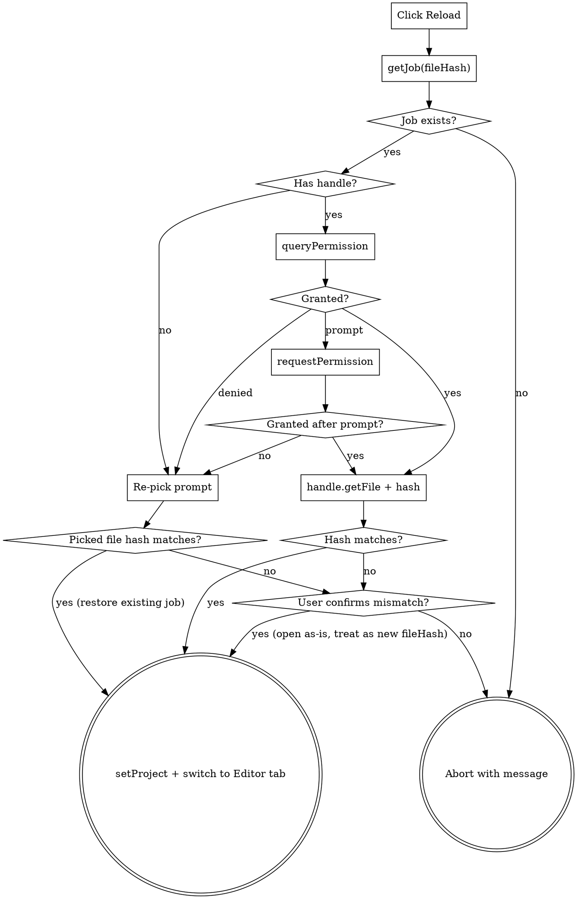

# Jobs history + persistent corrections — Design

**Date:** 2026-05-12
**Scope:** Replace the per-batch-run "History" tab with a per-file "Jobs" tab. Persist all corrections (with status) per page so they survive page changes and reloads. Allow reloading a saved job from the Jobs list, using the File System Access API when available, with a re-pick fallback. Everything is stored in the browser only.

## Goals

1. Every file the user has loaded shows up as a "job" in a Jobs tab.
2. A job persists the file's OCR'd text (already done), all corrections per page (new, including pending/rejected status), and a reference to the original file that the browser can later re-open (new, FSA handle when available).
3. The user can click "Reload" on a saved job to restore the full editor state — text, corrections, and (when the handle is available or the user re-picks the same file) the page images.
4. The user can "Delete" a job; this wipes every trace of that file from the browser.
5. No server. No PDF bytes stored. Pure browser persistence (IndexedDB).

## Non-goals

- Storing the PDF bytes themselves.
- Cross-device sync.
- Versioned snapshots of a job over time. Each job is the latest state of one file.
- Preserving the old per-run audit log. It is removed (the data it captured — model, cost — can be derived from per-page token counts already persisted).

## Architecture

### Storage layout (IndexedDB)

Bump database `llm_ocr_web` from `version 1` to `version 2`. After upgrade the DB has three stores:

| Store          | Key                       | Value shape                                  | Status        |
| -------------- | ------------------------- | -------------------------------------------- | ------------- |
| `pageResults`  | `${fileHash}:${pageNum6}` | `PageResult`                                 | Existing      |
| `jobs`         | `fileHash` (string)       | `JobRecord` (see below)                      | New           |
| `corrections`  | `${fileHash}:${pageNum6}` | `Correction[]`                               | New           |

```ts
interface JobRecord {
  fileHash: string;        // primary key
  fileName: string;        // display name (last loaded)
  pageCount: number;
  createdAt: number;       // epoch ms
  lastOpenedAt: number;    // epoch ms
  handle?: FileSystemFileHandle; // structured-cloneable on Chromium; absent elsewhere
}
```

The handle is **stored as-is**, relying on the structured clone path IDB takes for values. FSA spec guarantees handles are cloneable and durable across sessions.

The old `localStorage` key `llm_ocr_web:runHistory:v1` is removed on first run after the upgrade — see Migration.

### New modules

- `src/store/jobs.ts` — IDB wrapper for the `jobs` store:
  - `upsertJob(input: { fileHash, fileName, pageCount, handle? })` — creates a row or updates `fileName`/`pageCount`/`lastOpenedAt`. Preserves an existing `handle` if the new one is missing (so a drag-and-drop reload doesn't overwrite a handle captured earlier via `showOpenFilePicker`).
  - `listJobs(): Promise<JobRecord[]>` — sorted by `lastOpenedAt` desc.
  - `getJob(fileHash): Promise<JobRecord | undefined>`
  - `deleteJob(fileHash): Promise<void>` — single read/write transaction across `jobs`, `pageResults`, `corrections`; deletes every key for the hash.
  - `pruneJobs(max: number)` — keeps the newest `max` (default **50**) by `lastOpenedAt`; calls `deleteJob` on the rest.

- `src/store/correctionsStore.ts`:
  - `saveCorrections(fileHash, pageNum, corrections: Correction[]): Promise<void>`
  - `loadCorrections(fileHash, pageNum): Promise<Correction[]>` — returns `[]` if missing.
  - `deleteCorrectionsForFile(fileHash)` — used inside `deleteJob`.

- `src/store/reloadJob.ts`:
  - `reloadJob(fileHash): Promise<ReloadResult>` orchestrates the reload flow. See "Reload flow" below.

- `src/components/JobsList.tsx` — replaces the existing `RunHistory.tsx` (file deleted). Renders the Jobs table.

### Modified modules

- `src/store/persistence.ts` — bump `DB_VERSION` to 2; in the upgrade callback, create `jobs` and `corrections` stores. No data migration is needed in this file.
- `src/store/ProjectContext.tsx`:
  - Remove the line in `setCurrentPageNum` that clears `corrections`.
  - Add an async effect: when `currentPageNum` or `fileHash` changes, call `loadCorrections(fileHash, currentPageNum)` and set the result.
  - Add an effect that, when `corrections` changes and `fileHash` is non-empty, calls `saveCorrections(fileHash, currentPageNum, corrections)`. Debounced ~200ms to coalesce rapid edits.
  - Track an optional `handle: FileSystemFileHandle | null` so `FileDrop` (and reload) can pass it through.
- `src/components/FileDrop.tsx`:
  - When opening via the picker, use `window.showOpenFilePicker` if available (one-call API; captures a handle). Fall back to the existing hidden `<input type="file">` when not.
  - For drag-and-drop, try `DataTransferItem.getAsFileSystemHandle()` per item (Chromium); fall back to `getAsFile()`.
  - After hashing and `setProject`, call `upsertJob({ fileHash, fileName, pageCount, handle })`. Then `pruneJobs(50)`.
- `src/components/BatchRunner.tsx`: remove the `appendRun` call and the `runHistory` import.
- `src/App.tsx`: rename the `history` tab to `jobs`, render `<JobsList />` instead of `<RunHistory />`.
- `src/i18n/*`: rename `tabs.history` → `tabs.jobs`; add strings for Jobs columns, Reload, Delete, hash-mismatch warning, "saved in your browser only" privacy note, "file no longer available" message.
- Delete `src/store/runHistory.ts`, `src/store/runHistory.test.ts`, `src/components/RunHistory.tsx`.

## Reload flow



Notes:
- After a successful `setProject`, the reload helper also calls `upsertJob(...)` so `lastOpenedAt` advances.
- If the user opens a file whose hash differs from the requested job, we treat it as a brand-new file (its own job row) — we never reassign saved text/corrections from one hash to another.
- The "switch to Editor tab" step uses controlled `Tabs` state (the current `defaultValue="ocr"` becomes `value`/`onValueChange`).

## Corrections persistence

- `Correction` already carries `status: 'pending' | 'accepted' | 'rejected'`.
- The full array (whatever its state) is written to `corrections[fileHash:pageNum]` after every change.
- Loading: when the user navigates to a page (or reloads a job), the array is fetched and put into context. If the array references `old`/`new` substrings no longer present in the page text (e.g., the text was edited after accepting), the rendering layer already handles this in `accept()` by marking such items rejected; no schema change needed.
- Acceptance still calls `savePageResult` for the page text (existing behavior).

## Edge cases

- **No FSA support (Firefox, Safari)**: `showOpenFilePicker` is undefined; the picker uses the existing hidden file input. `handle` is `undefined`. Reload always falls through to the re-pick prompt, which still hits the same hash-match path.
- **Handle permission revoked**: `queryPermission` may return `'prompt'` after a browser restart. The reload flow handles that by calling `requestPermission`; user denial falls through to re-pick.
- **Handle file moved or deleted on disk**: `handle.getFile()` throws. Catch → fall through to re-pick, with a message.
- **Hash mismatch after reload**: file was edited externally. Show a confirm dialog: "This file's contents have changed since this job was saved. Open as a new job?". Yes → load as a new job (new `fileHash`, new `JobRecord`); No → abort.
- **Deletion of the currently open job**: `JobsList` checks `useProject().fileHash`; if equal, calls `resetProject()` after `deleteJob`.
- **Two jobs converge on the same file**: not possible — `fileHash` is the key.
- **Storage cap**: `pruneJobs(50)` deletes the oldest by `lastOpenedAt`. The cap is conservative; IDB has plenty of room but text + many corrections per file can add up.

## UI

- Tab order unchanged: `OCR · Editor · Export · Jobs` (renamed from `History`).
- Header inside the tab: short privacy note "Saved in your browser only — clear browser data to remove."
- Table columns: **File** · **Pages** · **Status** (e.g. `32 ok · 3 edited · 5 pending`) · **Cost** (sum of `estimateCost` over per-page tokens) · **Last opened** · **Actions** (Reload, Delete).
- Empty state: existing `history.empty` string is reused as `jobs.empty`.
- Delete uses `window.confirm` with the file name.
- Reload disables the button while in flight; on failure, surfaces the error inline (a small red row under the button).

## Testing

Unit:
- `src/store/jobs.test.ts` — upsert creates then updates `lastOpenedAt`; `listJobs` orders by recency; `deleteJob` cascades to `pageResults` and `corrections`; `pruneJobs` keeps newest N.
- `src/store/correctionsStore.test.ts` — round-trip an array including pending/accepted/rejected statuses.
- `src/store/reloadJob.test.ts` — three branches: success (mock handle, hash match), hash-mismatch (user confirms / declines), no-handle fallback (caller-provided pick stub).
- `src/store/persistence.test.ts` — existing tests should still pass after the v2 upgrade; add one that verifies the v1 → v2 upgrade callback runs without losing existing `pageResults`.

Integration (manual until we wire jsdom + idb-fake):
- Load file A, OCR a few pages, run a Fix that produces corrections, leave some pending, switch pages → come back → corrections still there.
- Reload the page (browser reload). Reload the job from Jobs tab. On Chromium expect one permission prompt; on Firefox expect a file-picker prompt. Verify text + corrections restored.
- Delete job → IDB row + page results + corrections gone; reloading the file produces a fresh job row.

## Migration

- `persistence.ts` `upgrade` callback at version 2: create stores `jobs` and `corrections` only if they don't exist. Existing `pageResults` are untouched.
- On app startup (once), remove `localStorage.removeItem('llm_ocr_web:runHistory:v1')`. We do not attempt to synthesize Job rows from orphan `pageResults` — those rows had no `fileName`/`pageCount`. Re-opening the file recreates the job naturally.

## Open questions / not in scope

- Renaming jobs. Out of scope; `fileName` updates if the user re-loads under a different name.
- Exporting/importing jobs. Out of scope.
- Server-side sync. Out of scope.

## Acceptance criteria

1. Loading a file creates or updates a Jobs row.
2. Switching pages, switching tabs, and reloading the browser all preserve corrections in their last status per page.
3. Jobs tab lists every saved file with pages/status/cost/last-opened and a working Delete.
4. On Chromium, "Reload" restores the editor state with a single permission prompt (or none) without the user picking the file.
5. On non-Chromium browsers, "Reload" prompts the user to pick the file; if its hash matches, the job restores; if not, the user is warned and the file is treated as a new job.
6. Delete removes the row, the page text, and the corrections from IDB; if the deleted job was open, the editor clears.
7. The `localStorage` `runHistory` key no longer exists; the History tab is gone; `BatchRunner` no longer writes anywhere about runs.
